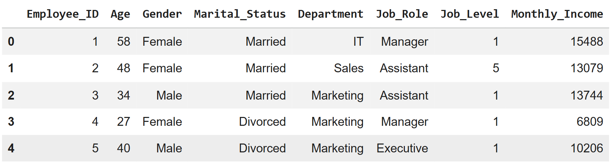
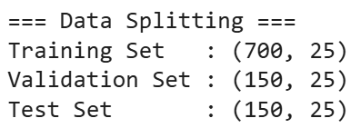
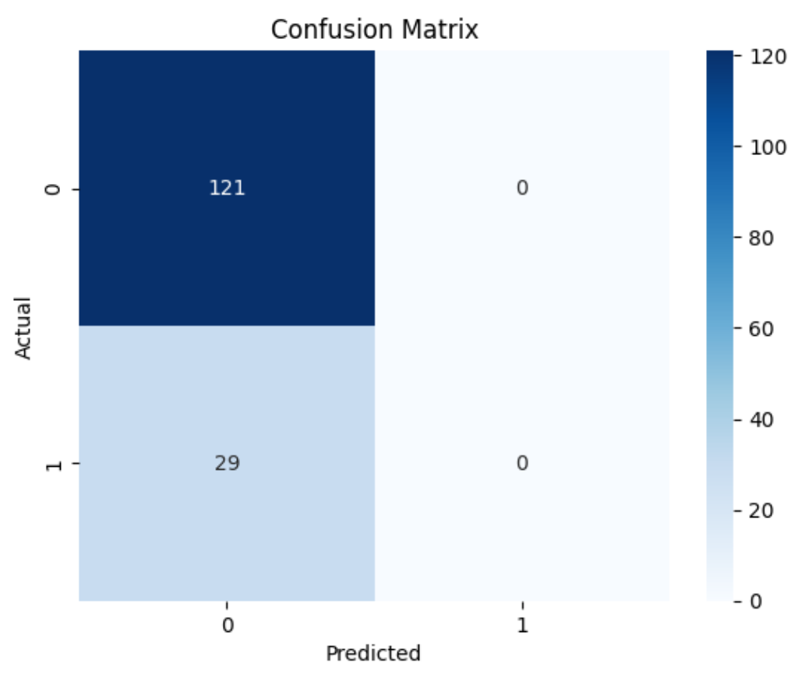
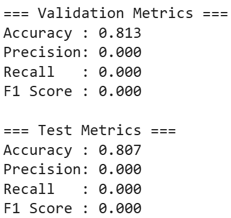
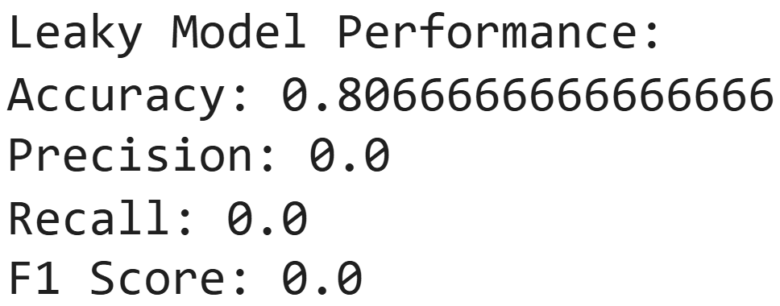
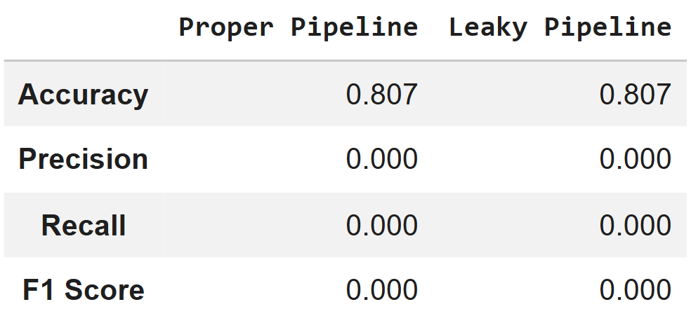
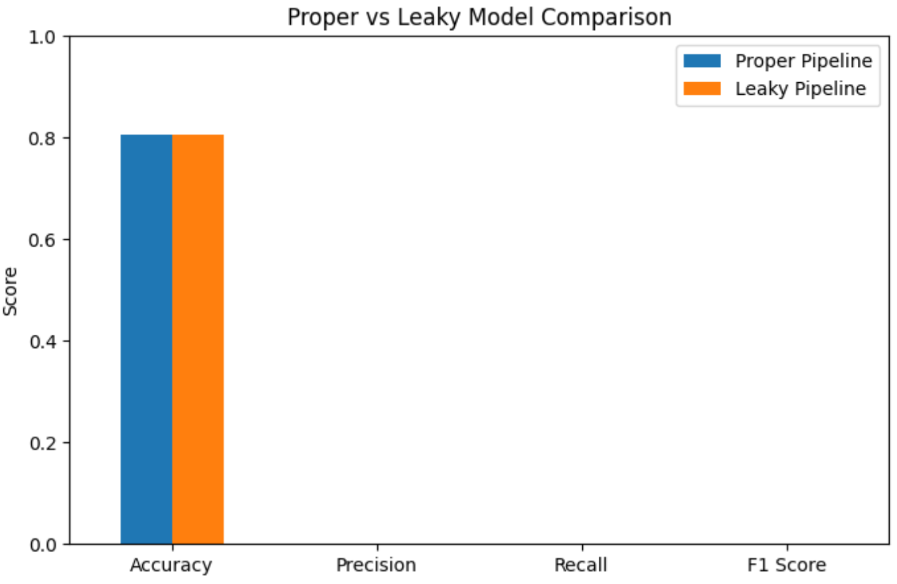

                              

# 🚀 Data Leakage Impact Study in Machine Learning

This project investigates how improper data handling can lead to misleading machine learning model performance.

## 🎯 Objective

To compare a **proper machine learning pipeline** with a **leaky pipeline** and analyze how data leakage affects model evaluation.

## 🧠 Key Concepts

* Data Leakage
* Model Evaluation
* Train/Validation/Test Splitting
* Feature Engineering Best Practices

## ⚙️ Workflow

* Data loading and exploration
* Proper data splitting (train, validation, test)
* Feature encoding and scaling (without leakage)
* Model training using Logistic Regression
* Performance evaluation (Accuracy, Precision, Recall, F1-score)
* Creating a leaky pipeline for comparison
* Analyzing performance differences

## 🔬 Experiment Design

### ✅ Proper Pipeline

* Preprocessing applied only on training data
* Evaluation on unseen test data

### ❌ Leaky Pipeline

* Preprocessing applied on full dataset before splitting
* Causes information leakage

## 📊 Results

* Proper pipeline provided reliable evaluation
* Leaky pipeline produced misleading results
* High accuracy did not reflect true model performance
* Precision, Recall, and F1-score revealed actual issues

## 🧠 Key Insights

* Data leakage can make models appear better than they actually are
* Accuracy alone is not a reliable metric
* Proper preprocessing is critical for real-world ML systems
* Experimental design is as important as model selection

## 🛠️ Tech Stack

* Python
* Pandas
* Scikit-learn
* Matplotlib / Seaborn
* Jupyter Notebook / Google Colab

## 📚 Key Learnings

* Understood the concept and impact of data leakage
* Learned importance of proper data splitting
* Realized why accuracy alone is not a reliable metric
* Gained experience in experimental ML design

## 🚀 Future Improvements

* Use advanced models (Random Forest, XGBoost)
* Apply cross-validation
* Handle class imbalance techniques
* Extend to real-world datasets

## 🤝 Contribution

Contributions are welcome! If you’d like to improve this project 
Feel free to explore, use, and improve the project 🚀

## 📄 License

This project is licensed under the MIT License 
see the [LICENSE↗](LICENSE) file for details.

## 📂 Dataset

The dataset used in this project is included in the `Dataset/` folder.

* File: `Employee_Attrition_Dataset.csv`

## 📸 Project Screenshots

### 🔹 Data Preview

### 🔹 Data Splitting

### 🔹 Model Performance (Proper Pipeline)

### 🔹 Confusion Matrix

### 🔹 Leaky Model Performance

### 🔹 Comparison Table

### 🔹 Performance Visualization

## ❗ Important Note

This project demonstrates that even small mistakes in data preprocessing can lead to misleading results, making model evaluation unreliable in real-world scenarios.

## 👩‍💻 Author

Bushra Shaikh